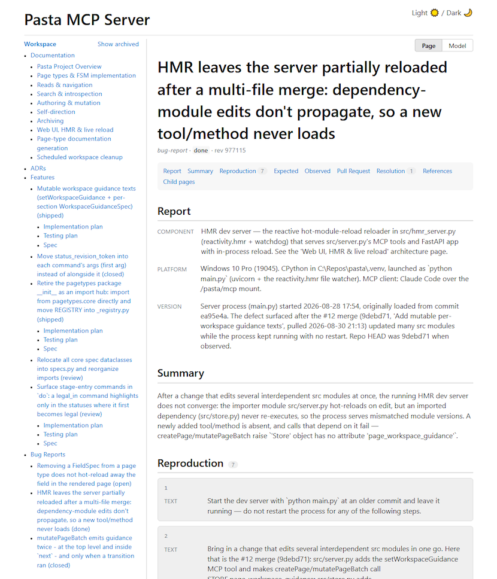
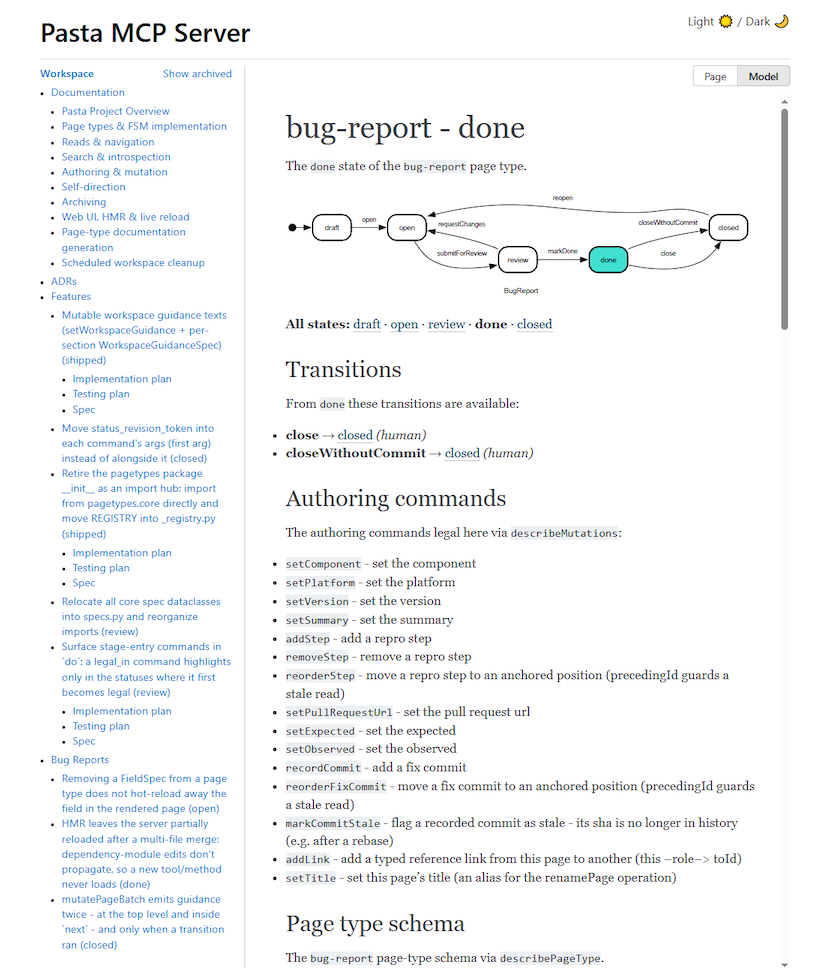

# pasta

**A structured wiki over MCP that tells your coding agent what to do next, and won't let it skip ahead.**

Pasta is an MCP server. Your project's features, bug reports, decision records and architecture notes live in it as **typed pages**, and every page carries a **status state machine**. On each write the server answers with the moves that are legal right now, the instruction for the exact stage the work is in, and the gates only a human is allowed to cross.

So a process you write down once (TDD, reproduce-before-you-fix, spec-then-plan) stops being something the agent read 40,000 tokens ago and starts being something it is handed at the moment it applies.

> *On the name: pages are driven by an **FSM**, and an FSM is of course the Flying Spaghetti Monster. Hence pasta.*



## The problem with putting your process in a prompt

Agents don't fail because they can't write code. They fail at the seams: they fix the symptom without reproducing the bug, plan against code they never opened, mark a test passed they never ran, and declare victory one step before the part that actually matters.

"Always work test-first" in a `CLAUDE.md` is read once, at the top of the session, and then competes with every token that follows. Pasta takes the opposite approach: the instruction is stored against the *state*, and the state machine decides when you get to see it.

## The loop

Every create and every write returns a `next` block. There is nothing else to consult, and nothing to ask the user about:

```jsonc
{
  "next": {
    "do":         [ /* edges legal right now: drive these */ ],
    "blocked":    [ /* not legal yet, with the unmet precondition named */ ],
    "humanGates": [ /* sign-off transitions: stop here */ ],
    "attention":  [ /* escalated questions waiting on a person */ ]
  }
}
```

| bucket | what it means | who |
| --- | --- | --- |
| `do` | transitions that are legal, plus the field setters *this stage* needs, each carrying its own authoring instruction | agent |
| `blocked` | an edge that isn't available yet; `reason` names the fix ("requires: steps.items", or the parent status that hasn't unlocked it) | agent |
| `humanGates` | sign-offs such as shipping a feature or closing a bug, listed whether or not their preconditions are met, so the agent can never silently drive past one | you |
| `attention` | a question the agent escalated instead of guessing | you |

`do` is deliberately narrow. It surfaces the setters whose fields gate the *current* stage, not every command that happens to be legal. So an agent in `grounding` is shown how to read the codebase, and is not yet shown the authoring surface for a plan it has no business writing.

## Quick start

```text
uv sync                      # Python 3.14
uv run python main.py        # http://localhost:8000
```

That serves the MCP endpoint at `/pasta/mcp` and the read-only web UI at `/` from one process. Leave a page open in the browser and it refreshes live as the agent writes.

Point your MCP client at it:

```json
{
  "mcpServers": {
    "pasta": { "type": "http", "url": "http://localhost:8000/pasta/mcp" }
  }
}
```

Workspaces are plain JSON files under `./.pasta-data` (override with `PASTA_DATA_DIR`). One file per workspace, backed up before the hourly cleanup sweep ever deletes anything.

### Give your agent the habit

An MCP server the agent *can* use isn't one it *will* use. Copy the bundled skills so the workflow starts in pasta rather than in an unplanned code edit:

```text
mkdir -p .claude/skills && cp -t .claude/skills -R path/to/pasta/.claude/skills/{pasta,cook}
```

Then start work with `/pasta` (or `/cook`, which is the same with a funnier name). The skill is four lines. All it does is tell the agent to call the servers instructions tool.

**Now ask your agent to `/cook` a feature, a simple change, a bug report or some documentation.**

## A process, written out

Here is the feature lifecycle that ships with pasta. It is not hardcoded anywhere; it's a page type declaring its statuses and its edges.

```text
draft
  │
grounding    read the code this feature touches; record only what you
  │          opened, and turn what reading cannot settle into a question
  │
spec         settle the design once, in the feature-spec child, then seal it
  │
planning     turn the sealed spec into steps and cases detailed enough to
  │          build from without deciding anything further
  │
planReview   read the plan against the spec, while fixing it is still cheap
  │
building     write the code, test-first, one step at a time
  │
review       verify every step and case against a run you actually saw
  │          <- human gate
shipped
```

Each status carries the instruction for the work it is for. Reach `building`, and this is what comes back with the write, not as advice at the start of the session but as the response to the transition itself:

> **building** - the plan is approved, and this is where code is written. Work the steps in their order and let the plan, not improvisation, decide what gets built.
>
> - Work test-first: write the failing test, watch it fail, write the least code that passes it, watch it pass, commit. Mark a step done or a case passed only from a run you actually saw.
> - Keep the pure logic pure […] and the code that performs effects stays a thin shell that calls them and applies what they return.
> - Stay surgical. Touch only what the step needs; leave adjacent code, comments and formatting exactly as found […]
>
> Anything the plan did not anticipate is a question, or a reopened plan, not a quiet improvisation.

Bug reports get their own discipline (`draft → open → review → done → closed`), where `draft` insists on a repro someone else can follow and an expected behaviour grounded in something outside the agent itself, and `open` opens with *reproduce it yourself first*.

None of this needs a restart to change. The dev server hot reloads its modules in place, so an edit to a status, an edge or a line of stage guidance is live on the very next MCP request; connected agent sessions stay connected and are simply told the tool list changed. You can tune your process against a session that is already running, which is the only practical way to find out whether an instruction actually lands.

### The model is readable, by you and by the agent

A read-only web UI serves the same pages, and every page can flip from **Page** to **Model**: the state diagram for its own type, the transitions available from where it currently sits, and the exact authoring commands legal here. Agents get the same thing over `describePageType` / `describeMutations`.



## Gates that actually hold

Some gates are about content: grounding does not begin without a summary, and a plan is not approved without a review verdict. Some read across pages: a feature cannot reach review while an implementation step is still todo or a test case still pending, because the parent's gate looks at its children. Some are about order: the spec has to be sealed before a single plan step can be written. And every edge is declared as belonging to the agent or to a human, so a sign-off is never something the agent can quietly fire on its own.

None of this makes the agent honest. What it does is turn "the test passed" and "the step is done" into separate, recorded, gated claims instead of a sentence in a summary.

## Page types

A feature brief is the root of new work, and it is the lifecycle above. It creates its spec, its implementation plan and its testing plan in the same commit, then keeps each one locked until the stage that unlocks it, so an agent still grounding is not handed the authoring surface for a plan it has no business writing yet.

An epic is for work too large for one brief: it decomposes into child briefs that are dispatched to subagents. A simple change is the compressed version for something small and self-contained, where the whole discipline has to fit in one working status, and a bug report, shown above, is its counterpart for a defect.

Pages are not free-form text either. A field is a scalar, a prose body, a list of elements that may each carry their own small state machine, or structured blocks with typed inline runs. An agent cannot quietly turn a spec into a paragraph of vibes.

## Write your own process

The lifecycles above are data, not framework internals. Each page type is one module under `src/pagetypes/`, holding its sections, fields, commands, guards and state machine, so adding a status or an edge is a declaration rather than a code path. The stage prose lives together in `src/pagetypes/_stage_guidance.py`, which means you can read and revise your whole process as prose, in one file. And `setWorkspaceGuidance` sets per-field house rules at runtime, without touching either.

Want your agent to always run the linter before review, or always write the ADR before the code? Add it to the status that owns that moment, and it will be there when the moment arrives.

## Development

Tasks run through [just](https://github.com/casey/just):

```text
just test        # full suite
just testincr    # incremental (pytest --testmon)
just types       # basedpyright
just main        # run the server
just docs        # generate page-type docs + Sphinx site
just dev         # server and a live docs site, in parallel
```

The core is pure and I/O-free (`model`, `pagetypes`, `fsm`, `commands`, `serialize`) with a thin stateful shell (`store`, `server`) around it, the same split the stage guidance keeps asking agents to respect.

## License

[AGPL-3.0](LICENSE)
